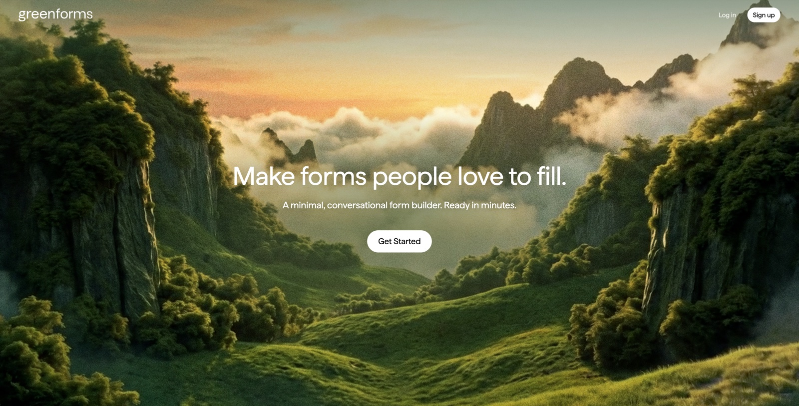

# Greenforms

A minimal, Typeform-style form builder.



## Features

- 13 question types: short text, long text, email, multiple choice, dropdown, number, phone, date, time, file upload, linear scale, rating, ranking.
- Conversational flow, one question per screen, with keyboard navigation.
- Drag-to-reorder question builder with live preview.
- Draft and publish workflow: published forms are snapshotted, so editing the draft never breaks a live link.
- Public share links at `/f/{id}` and a per-form responses dashboard.
- Auto-saving responses, cookie-tracked, resumable.

## Stack

- Backend: Django + django-ninja, SQLite (dev)
- Frontend: React + Vite + TypeScript + Tailwind

## Setup

Requires Python 3.11 and Node 20+.

```
pipenv install
npm install --prefix frontend
pipenv run python manage.py migrate
```

## Run

In two terminals:

```
pipenv run backend     # Django on http://127.0.0.1:8000
pipenv run frontend    # Vite on http://127.0.0.1:5173
```

## Seed demo data

Wipes every form owned by the given user and reseeds 5 demo forms (4 published, 1 draft) using the current question schema. Published forms are snapshotted, so the public `/f/{id}` URLs work immediately.

```
pipenv run python manage.py seed_demo --email you@example.com
```

The user must already exist. The form IDs change on every run, so grab the new ID from the editor or the command output.

## Docs

- [How it works](docs/how-it-works.md): quick walkthrough of the stack, lifecycle, and the snapshot system.
- [PRD](docs/prd/): product scope, data model, architecture, API design.
- [Question types](docs/questions/): per-type config and value shapes.
